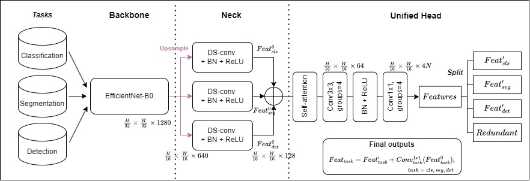

# 113-MILS HW2

## Data Description

I manually downloaded three datasets: [COCO 2017](https://cocodataset.org/#home), [PASCAL VOC 2012](http://host.robots.ox.ac.uk/pascal/VOC/voc2012/index.html), and [Imagenette](https://paperswithcode.com/dataset/imagenette). From each original training set, I randomly selected 240 data pairs as the `train` dataset. Additionally, I selected 60 data pairs from each original validation set to serve as the `val` and `test` datasets. These were then combined to form the customized mini-dataset as described below:

    data/
    ├─ mini_coco_det/{train,val,test}
    ├─ mini_voc_seg/{train,val,test}
    ├─ imagenette-160/{train,val,test}

Note: The original COCO dataset contains 80 classes. However, due to the limited amount of data in the mini version, only the first 10 classes are retained, and the remaining classes have been removed.

## Model Architecture

I design a unified multi-task architecture that efficiently performs object detection, semantic segmentation, and image classification within a single forward pass. The model is built on top of an EfficientNet-B0 backbone and includes task-specific lightweight neck modules, followed by a shared head for prediction. Task-specific identity mappings are added to improve gradient flow and learning stability.

For a 512×512 RGB input image, the model contains approximately:

Parameters: 7.842 million (7.842M)

FLOPs: 3.564 billion (3.564G)

This lightweight design ensures a good balance between performance and computational efficiency, making it suitable for resource-constrained environments.

<p align="center">  </p>

After passing through the EfficientNet backbone, the feature map is upsampled using a pixel-shuffle operation. The neck consists of three depthwise separable convolutional blocks, each dedicated to one of the three tasks (classification, segmentation, and detection). The outputs from these necks are then aggregated.

The spatial dimensions and feature map shapes at each stage are illustrated in the figure.

Finally, the aggregated feature map is projected to 4 × N channels to enable grouped convolution with 4 groups. Here, N denotes the maximum value among {nc_cls, nc_seg, nc_det + n_bbox × (4 + 1)}. Using grouped convolution ensures that task-specific information is not overly mixed across channels.

Each task-specific output is then refined by adding a 1×1 convolution of its corresponding neck feature, enabling residual learning and improved task decoupling.

## Training Strategy

Our training strategy combines three key components: small buffer loss aggregation, knowledge distillation, and learnable task weighting.

1. **Small Buffer Aggregation**. To address the instability caused by small batch sizes when training multiple tasks simultaneously, we adopt a small buffer mechanism. This approach accumulates losses from each task over a few mini-batches before performing backpropagation. It helps smooth the optimization process and improves convergence stability.

2. **Knowledge Distillation**. Each task (i.e., classification, segmentation, and detection) is first trained independently to obtain a strong baseline model, which serves as the teacher. During the joint training of the unified multi-task model (student), we apply knowledge distillation from these teacher models to guide learning.

3. **Learnable Task Weights**. Instead of using fixed loss weights, we introduce a learnable parameter vector
   w = [w_cls, w_seg, w_det], which dynamically adjusts the contribution of each task’s loss during training.
   To ensure that the weights remain within a stable and interpretable range, we apply a sigmoid activation to each weight and then normalize the vector so that the sum equals 1. This ensures a soft assignment of task importance while maintaining balance:

   _w_i = sigmoid(w_raw_i) / sum(sigmoid(w_raw))_

#### Overall Loss Function

_Loss_total = w_cls \* Loss_cls + w_seg \* Loss_seg + w_det \* Loss_det + lambda \* Loss_KD_

where:

• Loss_cls, Loss_seg, and Loss_det are the losses for classification, segmentation, and detection tasks, respectively.

• Loss_KD is the knowledge distillation loss from the teacher models.

• w_cls, w_seg, and w_det are learnable weights for each task.

• lambda is a fixed hyperparameter that controls the influence of the distillation loss.

## Training Steps

1. Prepare your training data and place it in the data/ directory. Each dataset should follow the official format and be separated into _train_, _val_, and _test_ splits as described above.
2. Since the Unified-OneHead Multi-Task model is trained using a distillation strategy, you must first train the three individual tasks (i.e., classification, segmentation, and detection) as teacher models (baselines), or alternatively, use pretrained weights. Note that any pretrained weights should be placed in the ./output/ folder.
3. Start training by running the following command:

   ```bash
   ## Baseline ##
   python train.py --det_root "[current_folder]/data/mini-coco-det/images/train" --det_ann "[current_folder]/data/mini-coco-det/annotations/instances_train.json" --seg_root "[current_folder]/data/mini-voc-seg" --cls_root "[current_folder]/data/imagenette-160/train" --epoch 30 --batchsize 16 --lr 1e-4 --train_type [task]

   ## Unified ##
   python train.py --det_root "[current_folder]/data/mini-coco-det/images/train" --det_ann "[current_folder]/data/mini-coco-det/annotations/instances_train.json" --seg_root "[current_folder]/data/mini-voc-seg" --cls_root "[current_folder]/data/imagenette-160/train" --epoch 50 --batchsize 4 --lr 3e-4 --lambda_distill 2 --train_type "all" --teacher
   ```

   Note: [current_folder] represents the absolute path of the training script, while [task] should be one of **'cls' / 'seg' / 'det'**.

4. After training, the model will be saved in the `output/` directory:

   ```
   output/
   ├─ all_best.pth
   ├─ cls_best.pth
   ├─ det_best.pth
   ├─ seg_best.pth
   ```

## Testing Steps

1. Run the following command to start testing:

   ```bash
   python test.py --det_root "[current_folder]/data/mini-coco-det/images/test" --det_ann "[current_folder]/data/mini-coco-det/annotations/instances_test.json" --seg_root "[current_folder]/data/mini-voc-seg" --cls_root "[current_folder]/data/imagenette-160/test" --task [task] --ckpt '[current_folder]/output/[task]_best.pth'
   ```

2. The test results will be displayed in the terminal.

## Results

#### Long Training:

| Method      | Classification (Acc.) | Segmentation (mIoU) | Detection (mAP) | Training epochs |
| ----------- | --------------------- | ------------------- | --------------- | --------------- |
| Baseline    | **0.9167**            | **0.4618**          | 0.0331          | 100             |
| **Unified** | 0.9000                | 0.4155              | **0.0551**      | 200             |
| Diff.       | -0.0167               | -0.0463             | +0.0220         | -               |
| <5% drop?   | ✅                    | ✅                  | ✅              | -               |

#### Quick Training:

| Method      | Classification (Acc.) | Segmentation (mIoU) | Detection (mAP) | Training epochs |
| ----------- | --------------------- | ------------------- | --------------- | --------------- |
| Baseline    | **0.8667**            | **0.3984**          | 0.0039          | 30              |
| **Unified** | 0.8500                | 0.3873              | **0.0448**      | 50              |
| Diff.       | -0.0167               | -0.0111             | +0.0403         | -               |
| <5% drop?   | ✅                    | ✅                  | ✅              | -               |

Since the output feature maps have a shape of H/16 × W/16 × C, different post-processing steps are required to convert them into formats suitable for evaluation or loss calculation.

Classification: A threshold is applied to filter out low-activation pixels, which are considered irrelevant for the prediction.

Segmentation: The output feature map is directly upsampled to the original image size using bilinear interpolation.

Detection: Similar to YOLOv1, non-maximum suppression (NMS) is applied to convert the feature map into bounding box predictions.

## Others

- Adjust parameters as needed.
- For detailed settings, please refer to the comments in each script file.
- If you need, please contact me to acquire the data I splited.
- My LLM dialogs are three chatting sections. [1](https://chatgpt.com/share/682e1acb-bf64-8005-8ede-ac9ee24b2b1c), [2](https://chatgpt.com/share/682e18fa-94c0-8005-85ce-0c56ddab638b), and [3](https://chatgpt.com/share/682e1ada-f110-8005-bc39-397896ba8112).
